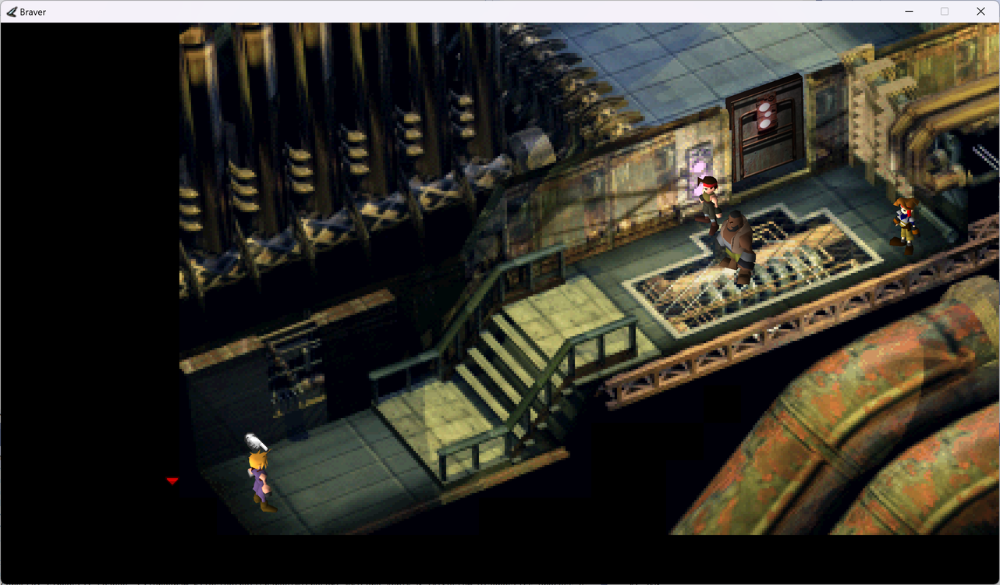
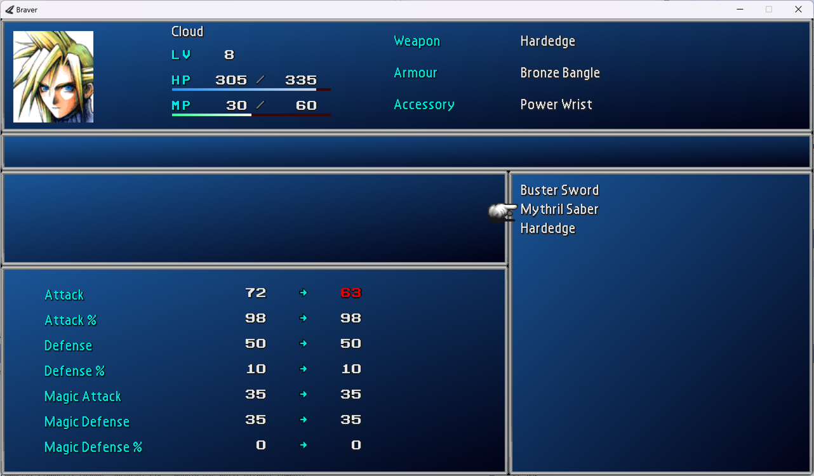
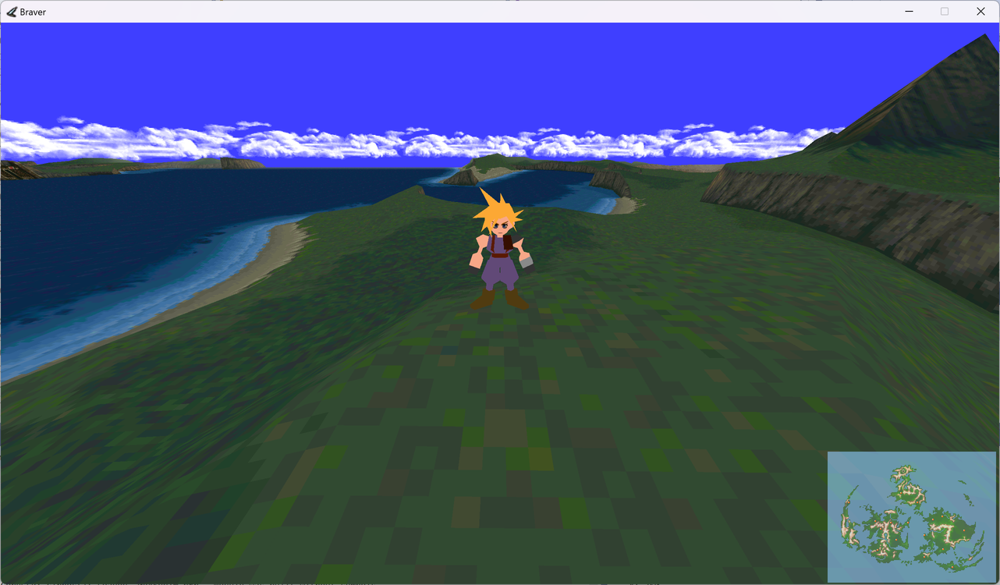
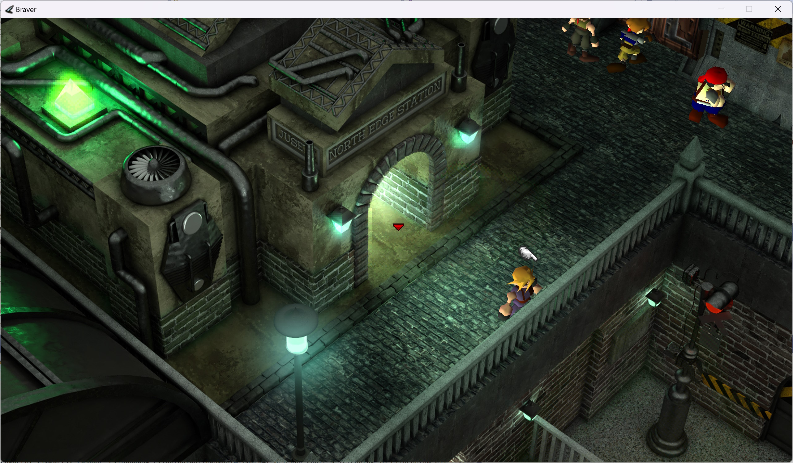

# Intro

Braver is a from scratch reimplemented game engine for the original (1997/8) FF7 PC release - although it should run with the more modern Steam re-release since that changes very little. 
The idea is to run the original game compatibly, from the original game files where possible, but also provide an
easily moddable/hackable engine for adding extra functionality.

## Downloads

Download the [latest release here](download.md)

## Progress

Braver is still in an early beta stage; however it can load and run a reasonable number of FF7 locations
already! You absolutely aren't going to use it to do a serious playthrough of the game yet.

The plan is to take a pragmatic approach to implementing things: i.e. prefer a solution
that works 80% of the time with minor glitches, but is playable in those cases, 
over not implementing something until it is perfect, or only implementing
it in the 20% of cases where it works without glitches. Of course, eventually
the hope is that Braver will work for every FF7 location/battle/etc.

## Field

- Field VM opcodes: ~60% implemented
- Backgrounds: Most background functionality implemented and will display correctly, but the Z ordering between
	backgrounds and the 3d models is hacked in and not reliable yet. Causes visual glitches rather than outright
	crashes or behavioural changes.
- 3d models: Most display correctly. Some of the speeds of animations / movements aren't correct.
- Movie playback: Mostly working, if you have versions of the movies FFMpeg can understand. Clipping between movie/models not perfect yet, although that often isn't apparent. Audio sync very much not correct.

## Battle

- Backgrounds load and display
- AI mostly (75%?) implemented
- Mechanics mostly implemented, but not fully tested yet
- Post battle screens (XP, AP, items) display but mostly don't do a lot yet
- Models load and display, but most animations, effects and camera movements aren't implemented.
	Player UI (HP/MP/Barrier gauges, etc.) partially implemented.
	Have just started working on tying up animations and effects, but only
	the very first parts are in place.
- Player menus (abilities, magic, items, etc.) mostly calculated correctly, but not fully tested

The end result is you can technically fight a battle, but while an static screenshot might look not too bad,
right now the lack of animations and effects mean it doesn't play very well. Technically the AI and mechanics 
mostly working means it's doing the right thing with regards to what the enemies do and what effects each
attack has, it just might not be obvious what's happened!

## World Map

Basic rendering of terrain and avatar done. Avatar movement based on
terrain type done. No scripting or encounters implemented yet.

## Audio

- Music playback works provided you have OGG files present. Looping works but is slightly glitchy
- Sound effect playback works. Looping sound effects are handled but not entirely correctly at the moment;
	sometimes it works fine, sometimes it's clearly looping something that shouldn't loop.

## Menus

- Main menu implemented
- Equip and materia menus implemented
- Shop menu partially implemented
- Character naming screen implemented
- Others not done yet

## Other functionality

- Basic plugin support has started to go in; plugins that replace
	files and affect backgrounds, dialog, sound effects and musi are implemented. Some basic 7th Heaven mod compatibility is implemented via a plugin.

## Current screenshots

Hi-res background replacement via plugin:

First few battle animations/effects decoded:

(i.e. playing the right combination of animations, movements, and
effects based on the game scripts)

<video width="960" height="540" controls>
<source src="Braver-0.12-BattleAnimations.mp4" type="video/mp4">
 Your browser does not support the video tag.
</video>
