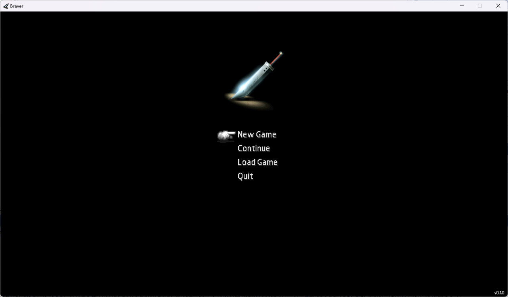
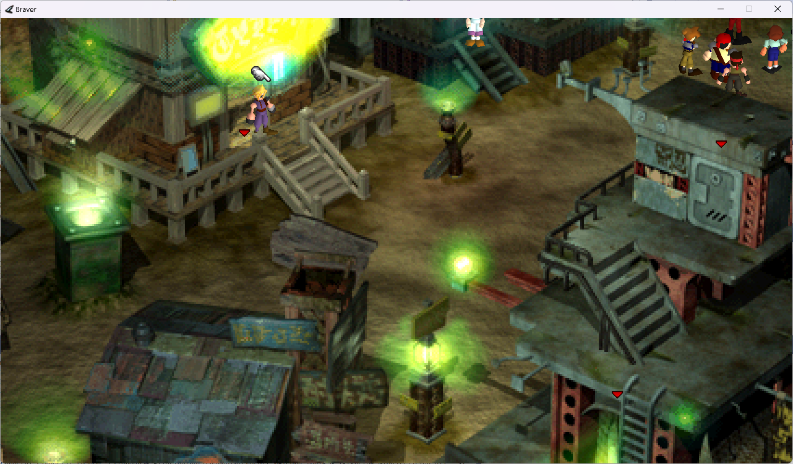

# Download

Download [Braver v0.1.1 here](https://github.com/ficed/Braver/releases)

Unzip the files to any location, then run BraverSetup. It will ask
you to enter a few locations - mainly where FF7 is installed.

You can then run Braver.exe and hopefully, you will see the starting menu!

If you have an XInput-compatible gamepad connected, the first gamepad should
automatically control the game. Alternatively, the default keyboard controls
are as follows:

| Key | Game control |
| --- | ------------ |
|  W  | Up |
|  A  | Left |
|  S  | Down |
|  D  | Right |
|  Enter  | OK |
|  Space  | Cancel |
|  [  | Left shoulder / rotate left |
|  ]  | Right shoulder / rotate right |
|  F1  | Start |
|  F2  | Select |
|  F3  | Menu |

## In case of problems

Braver should create a log file called `log.txt` in the folder you ran it from.
Any errors should hopefully be recorded here.

## v0.1.1

Released March 21st 2023. Should allow playing field locations up to the point 
where you leave the bar to begin the second reactor mission.

## v0.1.0

Released March 13th 2023. Initial public release. Allows playing
field locations up to the train scenes while escaping from the first 
reactor mission.